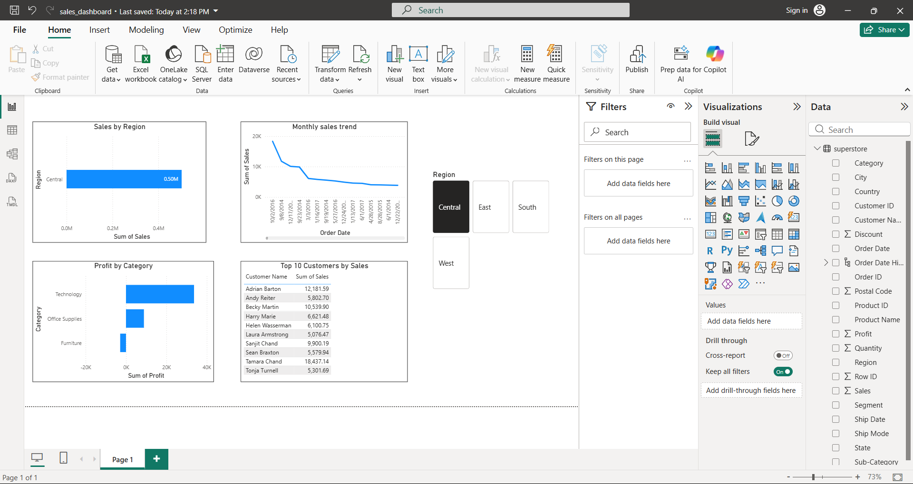

# Sales Performance & Customer Insights Analysis

## Objective
The objective of this project is to analyze retail sales data and extract meaningful business insights related to sales performance, profitability, and customer behavior.

## Dataset
- Source: Sample Superstore Dataset (Kaggle)
- Approx. 9,000 sales records
- Retail transactional data

## Tools & Technologies
- Python (Pandas, Matplotlib)
- SQL
- Power BI
- Excel
- GitHub

## Analysis Performed
- Data loading and preprocessing using Python
- Exploratory Data Analysis (EDA)
- Sales analysis by region
- Profit analysis by product category
- Monthly sales trend analysis
- Identification of top 10 customers by sales
- Identification of loss-making sub-categories

## SQL Analysis
SQL queries were written to:
- Calculate total sales by region
- Calculate total profit by category
- Analyze monthly sales trends
- Identify top 10 customers
- Identify loss-making sub-categories

## Power BI Dashboard
An interactive Power BI dashboard was created to visualize:
- Sales by Region
- Profit by Category
- Monthly Sales Trend
- Top 10 Customers

## Key Insights
- The West region generated the highest sales.
- The Technology category was the most profitable.
- Sales show seasonal trends across months.
- Some sub-categories consistently resulted in losses.

## Conclusion
This project demonstrates a complete data analysis workflow using Python, SQL, and Power BI. The insights derived can support better decision-making in sales strategy, inventory management, and profitability improvement.

## Author
Fathima Diya M
